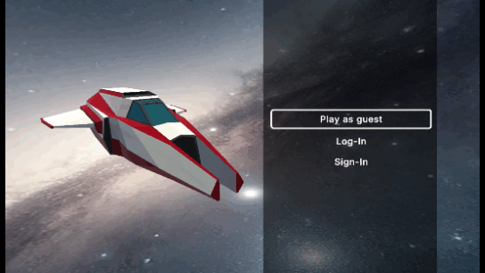
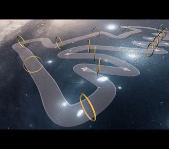
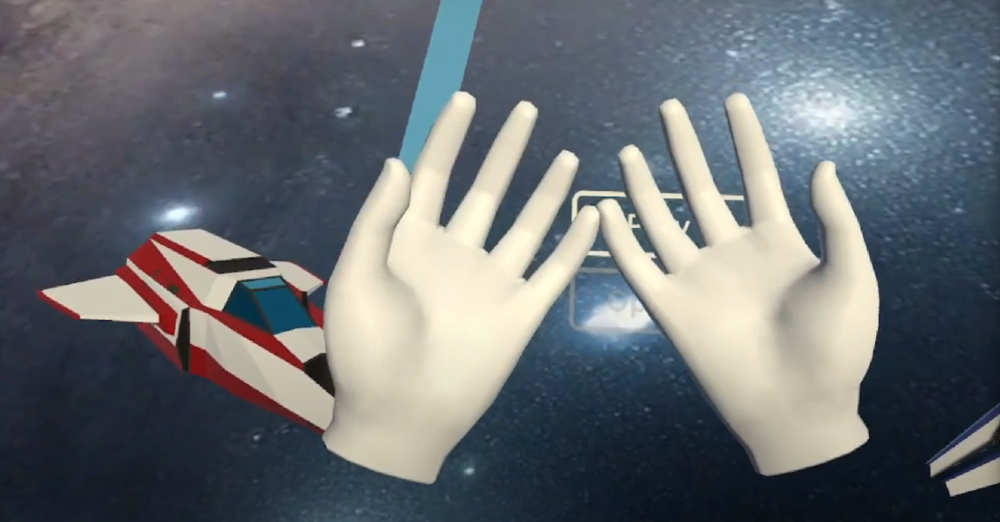

# Orbital Blitz
Orbital blitz is a racing game made by students of Epitech Lyon using Unity3D. This was our first Unity Project. It includes procedural generation of circuits and AIs trained with reinforcement learning.

It is playable here (not working properly with Edge) : https://5.39.76.139/

# Procedural Generation
  
The generation algorithm relies on the backtracking algorithm define a random path on a grid. Discontinuity is added by breaking up the generated path. A mesh is then extruded based on the final path.

# Reinforcement Learning
  
AIs have been trained using the MLagents library on our procedurally generated circuits.  

# Virtual Reality
  
The VR build of the game is available on the website ("VR Desktop" / "VR APK" in the navbar -> https://5.39.76.139/)

# Credits
**Melvin CERBA**        - Project Manager, Architect & Unity Developer  
**Jules BALANDRAS**     - Unity Developer  
**Emillien CHARREYRON** - Unity Developer  
**Xiaoyan CHEN**        - Web Developer  
**Timothée CLEAR**      - Unity Developer  
**Tarek DIAF​**          - Unity Developer  
**Xiangwei JIN**        - Unity Developer  
**Loann MAHDAR-RECORBET** - Unity Developer  
**Mohamed MRABET**      - DevOps  
**Simon PAROT**         - Unity Developer (VR)  

